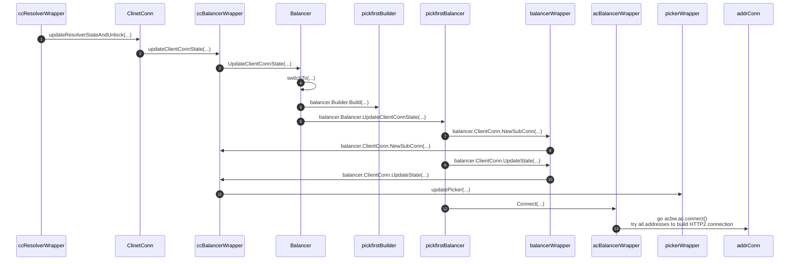

+++
title = "client of gRPC in go - balancer"
date = "2024-10-19T18:16:01+08:00"
draft = false
categories = ["go"]
tags = ["grpc", "code"]
author = ["wiser"]
description = "Source code of grpc-go"
ShowWordCount = true
+++

## 前言

上篇文章分析了 `grpc-go` 库中的整体流程以及 `resolver` 的构建以及如何解析服务地址，具体可以看[这里](/posts/client-of-grpc-in-go-resolver/)。

这篇将继续分析 `grpc-go` 中 balancer 是如何实现以及使用的。

## Balancer



resolver 解析 target server 地址后，会通过 `ccResolverWrapper` 实现的 `resolver.ClientConn` 接口的 `UpdateState` 方法调用 `ClientConn.updateResolverStateAndUnlock` 方法，该方法会通过解析 `ServiceConfig` 判断使用的 load balance 策略，默认是用 `FirstPick` 策略。

```go
func (cc *ClientConn) updateResolverStateAndUnlock(s resolver.State, err error) error {
    ...
    // 解析配置，决定 load balance 策略
	var ret error
	if cc.dopts.disableServiceConfig {
		channelz.Infof(logger, cc.channelz, "ignoring service config from resolver (%v) and applying the default because service config is disabled", s.ServiceConfig)
		cc.maybeApplyDefaultServiceConfig()
	} else if s.ServiceConfig == nil {
		cc.maybeApplyDefaultServiceConfig()
		// TODO: do we need to apply a failing LB policy if there is no
		// default, per the error handling design?
	} else {
		if sc, ok := s.ServiceConfig.Config.(*ServiceConfig); s.ServiceConfig.Err == nil && ok {
			configSelector := iresolver.GetConfigSelector(s)
			if configSelector != nil {
				if len(s.ServiceConfig.Config.(*ServiceConfig).Methods) != 0 {
					channelz.Infof(logger, cc.channelz, "method configs in service config will be ignored due to presence of config selector")
				}
			} else {
				configSelector = &defaultConfigSelector{sc}
			}
			cc.applyServiceConfigAndBalancer(sc, configSelector)
		} else {
			ret = balancer.ErrBadResolverState
			if cc.sc == nil {
				// Apply the failing LB only if we haven't received valid service config
				// from the name resolver in the past.
				cc.applyFailingLBLocked(s.ServiceConfig)
				cc.mu.Unlock()
				return ret
			}
		}
	}

	balCfg := cc.sc.lbConfig
	bw := cc.balancerWrapper
	cc.mu.Unlock()

	uccsErr := bw.updateClientConnState(&balancer.ClientConnState{ResolverState: s, BalancerConfig: balCfg})
	if ret == nil {
		ret = uccsErr // prefer ErrBadResolver state since any other error is
		// currently meaningless to the caller.
	}
	return ret
}

func (gsb *Balancer) UpdateClientConnState(state balancer.ClientConnState) error {
	// The resolver data is only relevant to the most recent LB Policy.
	balToUpdate := gsb.latestBalancer()
	gsbCfg, ok := state.BalancerConfig.(*lbConfig)
	if ok {
		// Switch to the child in the config unless it is already active.
		if balToUpdate == nil || gsbCfg.childBuilder.Name() != balToUpdate.builder.Name() {
			var err error
			balToUpdate, err = gsb.switchTo(gsbCfg.childBuilder)
			if err != nil {
				return fmt.Errorf("could not switch to new child balancer: %w", err)
			}
		}
		// Unwrap the child balancer's config.
		state.BalancerConfig = gsbCfg.childConfig
	}

	if balToUpdate == nil {
		return errBalancerClosed
	}

	// Perform this call without gsb.mu to prevent deadlocks if the child calls
	// back into the channel. The latest balancer can never be closed during a
	// call from the channel, even without gsb.mu held.
	return balToUpdate.UpdateClientConnState(state)
}
```

`gsb.switchTo`  方法会调用 `balancer.Builder.build` 方法，创建 load balance，即 `FirstPick` load balance，balancer 需要实现 `balance.Balancer` 接口，然后就会调用 `balance.Balancer.UpdateClientConnState` 方法，来处理从 resolver 解析过来的地址，每种 load balance 实现的策略不同，因此该方法的实现逻辑也各不相同；以 `FirstPick` load balance 为例，主要有以下调用：

1. 调用 `balancer.ClientConn.NewSubConn` 方法创建 `acBalancerWrapper` 对象
2. 初始化 `picker`，调用 `Balancer.ClientConn.UpdateState` 方法设置 `ClientConn.pickerWrapper` 字段
3. 调用 `balancer.SubConn.Connect` 方法建立连接

具体的代码调用，可以参考时序图中的方法调用查看，这里就不一一贴出来了。

## newClientStream

```go
func newClientStream(ctx context.Context, desc *StreamDesc, cc *ClientConn, method string, opts ...CallOption) (_ ClientStream, err error) {
    ...

	// Provide an opportunity for the first RPC to see the first service config
	// provided by the resolver.
	if err := cc.waitForResolvedAddrs(ctx); err != nil {
		return nil, err
	}

	var mc serviceconfig.MethodConfig
	var onCommit func()
	newStream := func(ctx context.Context, done func()) (iresolver.ClientStream, error) {
		return newClientStreamWithParams(ctx, desc, cc, method, mc, onCommit, done, opts...)
	}

    ...

	return newStream(ctx, func() {})
}
```

`newClientStream` 在初始化 `balancer` 以及 `picker` 后，由于 `resolver` 解析 server 地址是异步的，因此通过 `ClientConn.waitForResolvedAddrs` 方法，保证底层连接建立成功。然后通过 `newClientStreamWithParams` 方法建立 HTTP2 stream。

## newClientStreamWithParams

```go
func newClientStreamWithParams(ctx context.Context, desc *StreamDesc, cc *ClientConn, method string, mc serviceconfig.MethodConfig, onCommit, doneFunc func(), opts ...CallOption) (_ iresolver.ClientStream, err error) {
    ...

	cs := &clientStream{
		callHdr:      callHdr,
		ctx:          ctx,
		methodConfig: &mc,
		opts:         opts,
		callInfo:     c,
		cc:           cc,
		desc:         desc,
		codec:        c.codec,
		cp:           cp,
		comp:         comp,
		cancel:       cancel,
		firstAttempt: true,
		onCommit:     onCommit,
	}
	if !cc.dopts.disableRetry {
		cs.retryThrottler = cc.retryThrottler.Load().(*retryThrottler)
	}
	if ml := binarylog.GetMethodLogger(method); ml != nil {
		cs.binlogs = append(cs.binlogs, ml)
	}
	if cc.dopts.binaryLogger != nil {
		if ml := cc.dopts.binaryLogger.GetMethodLogger(method); ml != nil {
			cs.binlogs = append(cs.binlogs, ml)
		}
	}

	// Pick the transport to use and create a new stream on the transport.
	// Assign cs.attempt upon success.
	op := func(a *csAttempt) error {
		if err := a.getTransport(); err != nil {
			return err
		}
		if err := a.newStream(); err != nil {
			return err
		}
		// Because this operation is always called either here (while creating
		// the clientStream) or by the retry code while locked when replaying
		// the operation, it is safe to access cs.attempt directly.
		cs.attempt = a
		return nil
	}
	if err := cs.withRetry(op, func() { cs.bufferForRetryLocked(0, op, nil) }); err != nil {
		return nil, err
	}

    ...

	return cs, nil
}
```

`newClientStreamWithParams` 函数主要有以下工作：

1. 设置 stream 配置参数以及 proto codec
2. 初始化 `clientStream` 对象
3. 调用 `csAttempt.getTransport` 方法调用 `ClientConn.pickerWrapper.pick` 方法选择一个连接
4. 调用 `csAttempt.newStream` 在 pick 的底层连接上建立 stream

## 总结

到这里，基本上都捋清楚了 grpc-go 库是通过抽象一个 `Resolver` 接口实现服务发现，并通过 `Balancer` 接口实现负载均衡，以及一个 `Picker` 接口通过 load balance 策略从连接池中获取一个连接进行发送。不管是 gRPC unary request 还是 gRPC steaming request 都会建立一个 HTTP2 stream，并在这个 stream 上发送 request 以及接收 response。
