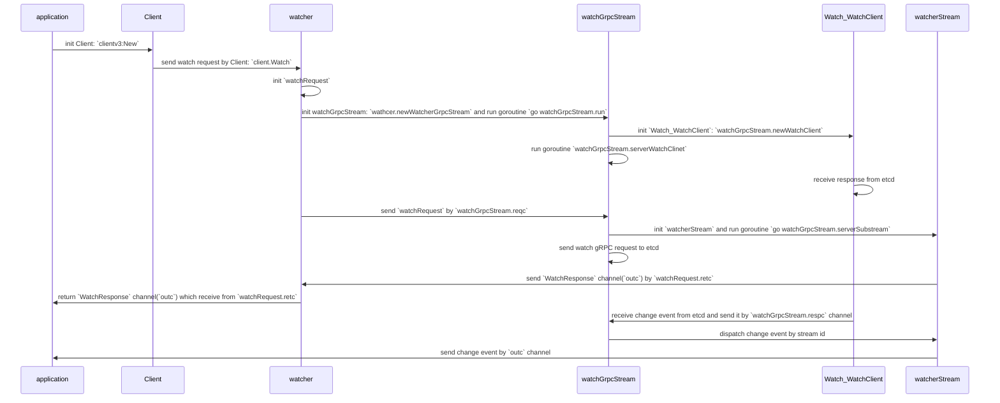

+++
title = "etcd watch"
date = "2025-10-06T18:05:25+08:00"
draft = false
categories = ["go"]
tags = ["etcd", "watch", "code"]
author = ["wiser"]
description = "etcd watch"
ShowWordCount = true
+++

# 前言

该篇文章主要记录阅读 etcd clientv3 中 watch 机制的实现以及在开发过程中遇到的由于 watch 代码中错误逻辑的处理不完善，导致 watch event 丢失等问题，并记录如何解决。

主要会包括以下 2 个方面：

1. etcd 客户端 watch 机制的实现
2. 问题记录以及解决

# etcd client watch


当使用 go etcd client 连接 etcd 并创建 watch 请求时，首先会初始化 `Client` 结构体，在该结构体中包含配置，连接，鉴权信息以及 etcd 相关 API 的接口实现等结构。

```go
type Client struct {
	Cluster
	KV
	Lease
	Watcher
	Auth
	Maintenance

	conn *grpc.ClientConn

	cfg      Config
	creds    grpccredentials.TransportCredentials
	resolver *resolver.EtcdManualResolver
	mu       *sync.RWMutex

	ctx    context.Context
	cancel context.CancelFunc

	// Username is a user name for authentication.
	Username string
	// Password is a password for authentication.
	Password        string
	authTokenBundle credentials.Bundle

	...
}
```

之后的所有请求都可以统一复用该结构体；其中 etcd `watch` API 相关结构的实现是通过 `watcher` 结构体实现。

客户端在发起 watch 请求后，会创建 gRPC 长连接的代理对象 `watcherGrpcStream`，同时会启动协程 `watcherGrpcStream.serveWatchClient` 持续轮询处理来自 etcd 服务端的响应。

## watch 流程



### Client.Watch

这里 `Client.Watch` 方法就是 `watcher.Watch` 方法，该方法的核心逻辑是：

- 初始化 `WatchRequest` 结构体，该结构体中包含我认为比较重要的字段 `createdNotify` 以及 `retc`；**其中 `createdNotify` 为 bool 表示是否返回 `Watch` 请求的 response 而 `retc` 则是用于返回 channel，该 channel 用于应用方接收 etcd 的返回。**
- `watcher.streams` 是 `map[string]*watchGrpcStream` 表示多个 gRPC stream，可以通过 `context.Value` 设置不同的 key，可以使用多个 watch 请求复用多个 gRPC stream，通常 key 为空且复用同一个 gRPC stream
- 如果 gRPC 连接或者 gRPC stream 没有初始化，调用 `watcher.newWatcherGrpcStream` 方法完成其初始化动作. `watchGrpcStream` 本身是有生命周期的，在 `watcher.newWatcherGrpcStream` 方法中，会异步开启一个协程负责 `watchGrpcStream` 的运行
- 将初始化的 `WatchRequest` 通过 `watchGrpcStream.reqc` 发送到 `watchGrpcStream` 的运行协程中处理
- 当 watch 请求处理完毕，对应的 watch channel 会通过 `WatchRequest.retc` 中传出

```go
import "context"

func (w *watcher) Watch(ctx context.Context, key string, opts ...OpOption) WatchChan {

	// ...

	wr := &watchRequest{
		ctx:            ctx,
		createdNotify:  ow.createdNotify,
		key:            string(ow.key),
		end:            string(ow.end),
		rev:            ow.rev,
		progressNotify: ow.progressNotify,
		fragment:       ow.fragment,
		filters:        filters,
		prevKV:         ow.prevKV,
		retc:           make(chan chan WatchResponse, 1),
	}

	ok := false
	ctxKey := streamKeyFromCtx(ctx)

	var closeCh chan WatchResponse
	for {
		// find or allocate appropriate grpc watch stream
		w.mu.Lock()
		if w.streams == nil {
			// closed
			w.mu.Unlock()
			ch := make(chan WatchResponse)
			close(ch)
			return ch
		}
		// 通过 ctxKey 标识唯一的 gRPC stream
		wgs := w.streams[ctxKey]
		if wgs == nil {
			wgs = w.newWatcherGrpcStream(ctx)
			w.streams[ctxKey] = wgs
		}
		donec := wgs.donec
		reqc := wgs.reqc
		w.mu.Unlock()

		// couldn't create channel; return closed channel
		if closeCh == nil {
			closeCh = make(chan WatchResponse, 1)
		}

		// submit request
		select {
		case reqc <- wr:
			ok = true
			// ...
		}

		// receive channel
		if ok {
			select {
			// 接收 WatchResponse channel
			case ret := <-wr.retc:
				return ret
				// ...
			}
		}
		break
	}

	close(closeCh)
	return closeCh
}
```

**补充：可以通过 `clientv3.WithCreatedNotify()` 函数设置 `createdNotify` 字段。**

### watchGrpcStream.run

在该方法中，主要实现以下逻辑：

- 通过 `watchGrpcStream.newWatchClient` 方法，构造了和 etcd 服务端之间的 gRPC 连接以及 gRPC stream

```go
func (w *watchGrpcStream) newWatchClient() (pb.Watch_WatchClient, error) {
	// ...
	// 通过 `watchGrpcStream.openWatchClient` 方法创建 gRPC 连接以及 gRPC stream
	wc, err := w.openWatchClient()
	// ...
	// 通过 `watchGrpcStream.serverWatchClient` 方法持续从 gRPC 连接中接收 etcd 返回的响应
	go w.serveWatchClient(wc)

	return wc
}

func (w *watchGrpcStream) openWatchClient() (ws pb.Watch_WatchClient, err error) {
	// ...
	for {
		// ...
		// 通过发起 gRPC watch reqeust 建立 gRPC 连接以及 gRPC stream
		if ws, err = w.remote.Watch(w.ctx, w.callOpts...); ws != nil && err == nil {
			break
		}
		// ...
	}
	return ws, nil
}

func (w *watchGrpcStream) serveWatchClient(wc pb.Watch_WatchClient) {
	for {
		// 从 gRPC 连接中接收返回
		resp, err := wc.Recv()
		// ...
		select {
		case w.respc <- resp:
		case <-w.donec:
			return
		}
	}
}
```

- 持续轮询的处理来自应用发送的请求以及来自 etcd 返回的响应
- 当应用新发送一个 watch 的请求时，会创建一个新的 `watcherStream` 并运行一个 goroutine 调用 `watchGrpcStream.serverSubstream` 方法服务与不同的 watch 请求
- 从 response channel 中接收 etcd 响应的数据，并通过 `watchGrpcStream.dispatchEvent` 发给专属的 `watcherStream`

```go
import (
	"time"

	"go.uber.org/zap"
)

func (w *watchGrpcStream) run() {
	var wc pb.Watch_WatchClient
	// ..

	// start a stream with the etcd grpc server
	if wc, closeErr = w.newWatchClient(); closeErr != nil {
		return
	}

	cancelSet := make(map[int64]struct{})

	var cur *pb.WatchResponse
	backoff := time.Millisecond
	for {
		select {
		// 处理 Watch() 请求
		case req := <-w.reqc:
			switch wreq := req.(type) {
			case *watchRequest:
				outc := make(chan WatchResponse, 1)
				// TODO: pass custom watch ID?
				ws := &watcherStream{
					initReq: *wreq,
					id:      InvalidWatchID,
					outc:    outc,
					// unbuffered so resumes won't cause repeat events
					recvc: make(chan *WatchResponse),
				}

				ws.donec = make(chan struct{})
				w.wg.Add(1)
				// 为每一个 watch 请求创建一个 goroutine 处理 etcd 返回的响应
				go w.serveSubstream(ws, w.resumec)

				// queue up for watcher creation/resume
				w.resuming = append(w.resuming, ws)
				if len(w.resuming) == 1 {
					// 发送 watch gRPC 请求
					// head of resume queue, can register a new watcher
					if err := wc.Send(ws.initReq.toPB()); err != nil {
						w.lg.Debug("error when sending request", zap.Error(err))
					}
				}
				// ...
			}

		// new events from the watch client
		case pbresp := <-w.respc:
			if cur == nil || pbresp.Created || pbresp.Canceled {
				cur = pbresp
			} else if cur != nil && cur.WatchId == pbresp.WatchId {
				// merge new events
				cur.Events = append(cur.Events, pbresp.Events...)
				// update "Fragment" field; last response with "Fragment" == false
				cur.Fragment = pbresp.Fragment
			}

			switch {
			// Watch() 请求返回成功的响应
			case pbresp.Created:
				// response to head of queue creation
				if len(w.resuming) != 0 {
					if ws := w.resuming[0]; ws != nil {
						w.addSubstream(pbresp, ws)
						w.dispatchEvent(pbresp)
						w.resuming[0] = nil
					}
				}

				// ...

			// 发送 WatchCancelRequest 时，正常退出时接收到的响应
			case pbresp.Canceled && pbresp.CompactRevision == 0:
				delete(cancelSet, pbresp.WatchId)
				if ws, ok := w.substreams[pbresp.WatchId]; ok {
					// signal to stream goroutine to update closingc
					close(ws.recvc)
					closing[ws] = struct{}{}
				}

				// reset for next iteration
				cur = nil

			// ...

			default:
				// dispatch to appropriate watch stream
				ok := w.dispatchEvent(cur)

				// ...
			}

			// ...
		}
	}
}

func (w *watchGrpcStream) dispatchEvent(pbresp *pb.WatchResponse) bool {
	events := make([]*Event, len(pbresp.Events))
	for i, ev := range pbresp.Events {
		events[i] = (*Event)(ev)
	}
	// TODO: return watch ID?
	wr := &WatchResponse{
		Header:          *pbresp.Header,
		Events:          events,
		CompactRevision: pbresp.CompactRevision,
		Created:         pbresp.Created,
		Canceled:        pbresp.Canceled,
		cancelReason:    pbresp.CancelReason,
	}

	// ...

	return w.unicastResponse(wr, pbresp.WatchId)

}

func (w *watchGrpcStream) unicastResponse(wr *WatchResponse, watchId int64) bool {
	ws, ok := w.substreams[watchId]
	if !ok {
		return false
	}
	select {
	case ws.recvc <- wr:
	case <-ws.donec:
		return false
	}
	return true
}
```

当 `watchGrpcStream` 的运行协程通过 `respc` 接收到 etcd 的响应后，根据 `pbresp.Created` 以及 `pbresp.Canceled` 和 `pbresp.CompactRevision` 字段分为不同的情况处理。

1. `pbresp.Created` 为 true 时；则 watch gRPC 请求成功
2. `pbresp.Canceled` 为 true 且 `pbresp.CompactRevision` 为 0 时；则是 watch cancel reqeust 请求成功
3. 返回响应给应用方处理

<span id="watch-resp">对于返回的 etcd 响应需要根据 etcd 中的代码逻辑仔细处理；防止出现 watch 失败以及 change 事件丢失等 bug。</span>

注意到，在初始化 `watcherStream` 时，stream id 为 `InvalidWatchID`，在收到第一个 watch response 时，会更改为 stream id。

```go
import "errors"

func (w *watchGrpcStream) addSubstream(resp *pb.WatchResponse, ws *watcherStream) {
	// check watch ID for backward compatibility (<= v3.3)
	if resp.WatchId == InvalidWatchID || (resp.Canceled && resp.CancelReason != "") {
		w.closeErr = v3rpc.Error(errors.New(resp.CancelReason))
		// failed; no channel
		close(ws.recvc)
		return
	}
	ws.id = resp.WatchId
	w.substreams[ws.id] = ws
}
```

最后会通过 `watchGrpcStream.dispatchEvent` 方法，通过将其投递到 `watcherStream` 的 `recvc` 当中。

### watchGrpcStream.serveSubstream

在该方法中，处理的逻辑主要是收到 etcd 的响应后，需要返回给特定的 watch channel，这里通过提前创建好的 `outc` channel，应用方通过这个 channel 接收 etcd 的 response。

```go
func (w *watchGrpcStream) serveSubstream(ws *watcherStream, resumec chan struct{}) {
	// ...

	// nextRev is the minimum expected next revision
	nextRev := ws.initReq.rev
	// ...

	emptyWr := &WatchResponse{}
	for {
		curWr := emptyWr
		outc := ws.outc

		if len(ws.buf) > 0 {
			curWr = ws.buf[0]
		} else {
			outc = nil
		}
		select {
		// 发送 etcd response
		case outc <- *curWr:
			if ws.buf[0].Err() != nil {
				return
			}
			ws.buf[0] = nil
			ws.buf = ws.buf[1:]
		// 接收 etcd response
		case wr, ok := <-ws.recvc:
			if !ok {
				// shutdown from closeSubstream
				return
			}

			if wr.Created {
				if ws.initReq.retc != nil {
					ws.initReq.retc <- ws.outc
					// to prevent next write from taking the slot in buffered channel
					// and posting duplicate create events
					ws.initReq.retc = nil

					// send first creation event only if requested
					if ws.initReq.createdNotify {
						ws.outc <- *wr
					}
					// ...
					if ws.initReq.rev == 0 {
						nextRev = wr.Header.Revision
					}
				}
			} else {
				// current progress of watch; <= store revision
				nextRev = wr.Header.Revision + 1
			}

			if len(wr.Events) > 0 {
				nextRev = wr.Events[len(wr.Events)-1].Kv.ModRevision + 1
			}
			ws.initReq.rev = nextRev

			// created event is already sent above,
			// watcher should not post duplicate events
			if wr.Created {
				continue
			}

			// TODO pause channel if buffer gets too large
			ws.buf = append(ws.buf, wr)
			// ...
		}
	}
	// lazily send cancel message if events on missing id
}
```

# 问题记录

由于业务需求，某个应用需要 watch 多个应用实例；因此这里会有多个实现方案的选择；比较粗糙的一种是 watch 的每个服务有各自的 client，即有各自的 gRPC 连接，或者使用优雅的方式多个服务复用一条 gRPC 连接；因此在采用复用连接的方式时，需要小心处理每一个 watch 请求；而该问题就是关于 watch 请求的响应没有正确的处理，导致 watch 请求没有成功从而导致无法获取应用实例的变化。

由于第一次的 watch 请求，会建立 gRPC 连接并会通过 HTTP2 的状态码返回是否 watch 成功，因此第一次 watch 的成功与否都可以通过返回的 error 判断是否成功；但是对于基于已经建立的连接在次发起 watch 请求时，由于不会在会有 HTTP2 的状态码返回，因此第二次的 watch 从 API 接口来说永远都是成功的。

此时；需要通过 `WatchResponse` 中的字段判断是否 watch 成功，在 go client 中也有相似逻辑；具体见[这里](#watch-resp)。

对于 rust 代码，增加以下内容解决：

```rust
impl<'a> TryFrom<&'a WatchResponse> for WatchResponseType<'a> {
    type Error = Error;

    fn try_from(resp: &'a WatchResponse) -> Result<Self, Self::Error> {
        match (resp.created(), resp.canceled()) {
            (true, false) => Ok(WatchResponseType::Created(resp.watch_id())),
            (true, true) => Err(Error::OtherError(resp.cancel_reason().to_owned())),
            (false, true) => {
                if resp.compact_revision() != 0 {
                    // WARN: Due to watched keys are compacted by etcd,
                    // there maybe some changed keys are missed, so this can't be retried.
                    Err(Error::OtherError(
                        "etcd watch is canceled by key compation".into(),
                    ))
                } else {
                    Err(Error::OtherError("etcd watch is canceled normal".into()))
                }
            }
            (false, false) => match resp.header() {
                Some(header) => Ok(WatchResponseType::Events(
                    resp.watch_id(),
                    header.revision(),
                    resp.events(),
                )),
                None => Err(EtcdError::WatchError(format!(
                    "watch response is invalid for watch id {}",
                    resp.watch_id()
                ))
                .into()),
            },
        }
    }
}
```
